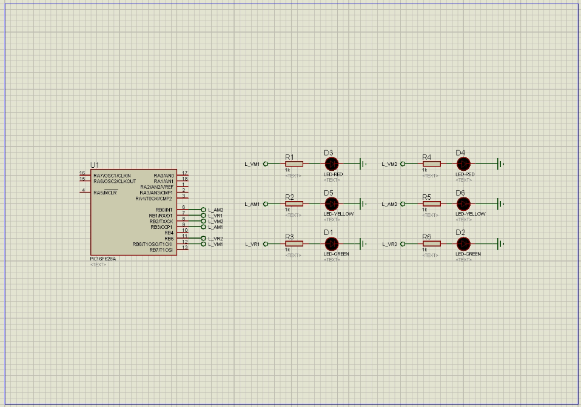
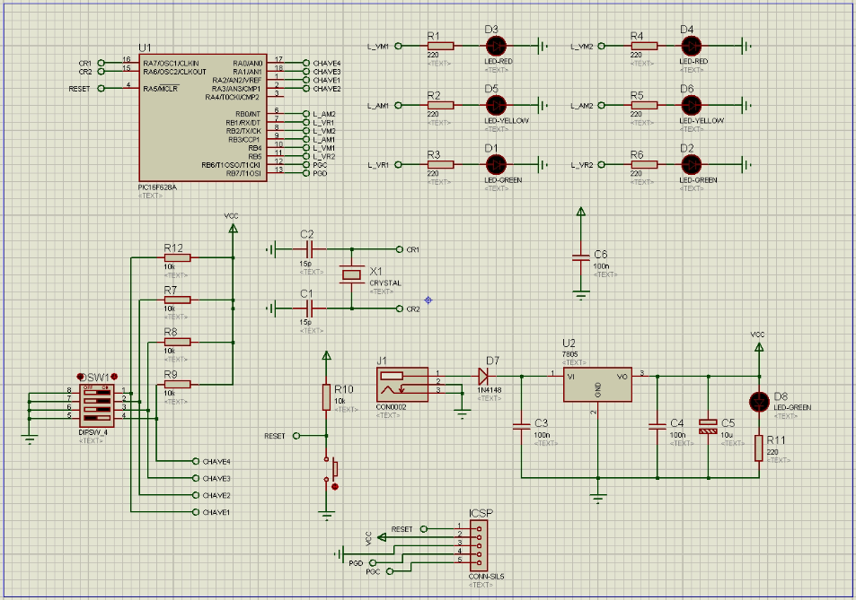
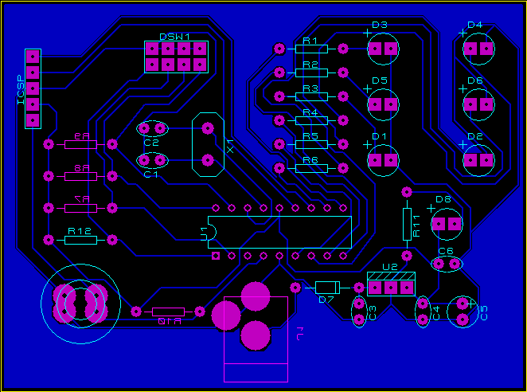

# IMD-PCI

Este repositório é destinado a apresentar um projeto de Placa de Circuito Impresso(PCI) desenvolvida durante as aulas da disciplina de **Prototipagem e Montagem de Circuito Impresso** do Instituto Metrópole Digital(IMD).

## Algoritmo

A programação foi feita para uso no **PIC16F628A** e possui um algoritmo de acionamento de dois semáforos representados por leds:
- Semáforo 1: D3, D5 e D1; e
- Semáforo 2: D4, D6 e D2.

Obs.: as conexões feitas nas portas do PIC, apesar de não estarem em ordem, seguem o esquemático descrito em aula.

O código pode não ser compatível com outros PICs, mas a lógica pode ser aplicada da mesma forma. Os semáforos seguem o seguinte loop de acionamento: 

Tempo aceso | Semaforo 1 | Semaforo 2
------------|------------|-----------
3s | RB1 (D1, verde) | RB2 (D4, vermelho)
1s | RB3 (D5, amarelo) | RB2 (D4, vermelho)
3s | RB4 (D3, vermelho) | RB5 (D2, verde)
1s | RB4 (D3, vermelho) | RB0 (D6, verde)

## Esquemático

O esquemático do projeto foi desenvolvido no [Proteus](https://www.labcenter.com/) Isis e conta o circuito do microcontrolador com o acionamento dos semáforos e circuitos complementares que possibilitam o desenvolvimento de um prototipo operável.

Circuitos:
- Circuito do microcontrolador;
- Circuito do reset do PIC;
- Circuito do cristal;
- Circuito de chaveamento DIP switch;
- Circuito do gravador;
- Circuito da fonte;

## Diagrama

O layout do projeto foi desenvolvido no [Proteus](https://www.labcenter.com/) Ares e conta com apenas um layer.

Na foto do layout possui a indicação das trilhas e posicionamentos dos componenetes dimensionados segundo o [desenvolvedor do projeto](https://github.com/rodrigoCodDev).
